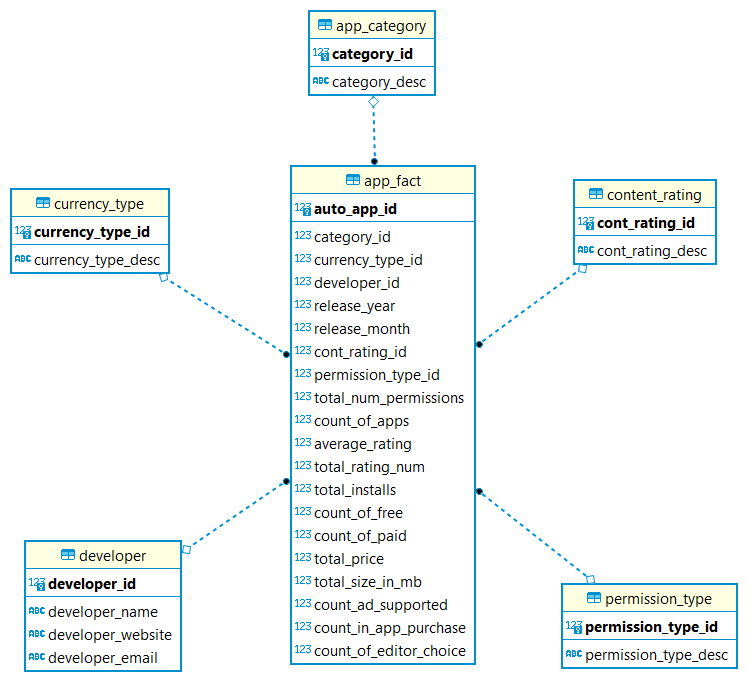
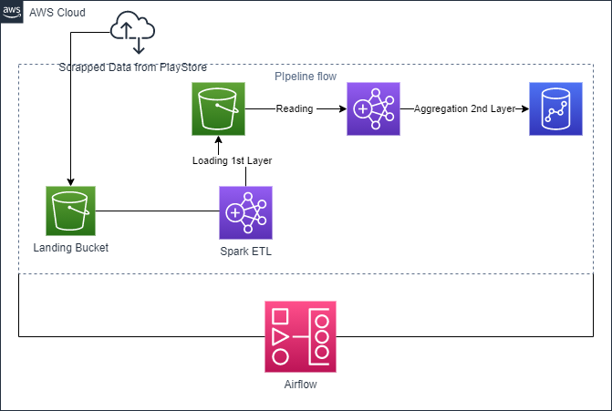
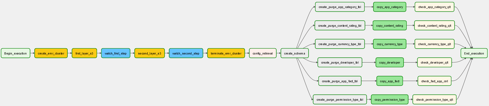

# Data Engineering Capstone

## **Project Scope:**

### **Project Summary:**

There are many apps on Google app store. The entries and records for these apps
on the app store can be analyzed to get useful insights like the following:
 - Rank of the categories for the apps.
 - Which apps get the higher rating in relation to the permisisons or features it contain.
 - Rank of the companies or developers according to the average ratings for the apps they developed.

### **Project Steps:**

This section will list the steps taken to model and implement the ETL process
for the final model.
 - ### **Gathering the datasets**:
   The datasets which are used for this project as follows:
   
    1- Google play store apps: This dataset contains the main attributes for each app on google app store. This dataset is in csv format. The link for this dataset is https://www.kaggle.com/gauthamp10/google-playstore-apps
    
    2- Android app required permissions: This dataset contains the permissions required by each app on google app store. This dataset is in json format. The link for this dataset is https://www.kaggle.com/gauthamp10/app-permissions-android?select=googleplay-app-permission.json
 - ### **Profiling the dataset:**
   Profiling has been done on the first dataset only as it contains the main attributes for this model.[Googl_App_Store.zip](Profiling_Results/Googl_App_Store.zip)
   - ### **Modelling:** 
     The model contains two layers:
   
     **1- Detail SnowFlake Schema:** This layer contains the data in a SnowFlake shmea with no aggregation. This is to support building any needed data mart
        for any future requirements. It will also serve any ad hoc queries cannot be addressed by the developed data marts in the Stark schema model.
        The list of tables included in this layer as follow:
     - App: It is main fact table and hold the information for any app on Google play store. It contains the folllowing columms:
       - App_Id: A string for app that serves as an id for the app.
       - App_Name: Name of the app on app store
       - Category_Id: Foreign key to the table App_Category.
       - Rating: The overall rating for the app
       - Rating_Num: Number of users who rated the app.
       - Minimum_Installs: Minimum number of installs for the app.
       - Maximum_Installs: Maximum number of installs for the app.
       - Is_Free: Flag to indicate if the app free
       - Price: Price of the app on google app store.
       - Currency_Type_Id: Foreign key to the table Currency_Type.
       - Siz_In_MB: Disk Size of the app in megabytes.
       - Supp_OS_Version: Minimum Android OS version supported by the app.
       - Developer_Id: Foreign key to the table Developer.
       - Relase_Dt: The first release date for the app.
       - Last_Update_Dt: The date for the last update of this app.
       - Cont_Rating_Id: Foreign key to the table Content_Rating.
       - Privacy_Policy: URL for the privacy policy for this app.
       - Is_Ad_Supported: A flag if the app contains ads.
       - Is_In_App_Purchase: A flag if there is addiotnal purchase will be required for extra contents or extra features.
       - Is_Editor_Choice: A Flag if the app one of the best Android apps of all-time on Google Play Store.
       - Scrapped_Dttm: Technical column for recording the scrapping timestamp for the app from Google Play Store. 
     - App_Category: This is a lookup table for different App categories.
       - Category_Id: Unique Id for the table.
       - Category_Desc: The category name or description.
     - Content_Rating: This is a lookup table for the different content rating
       - Cont_Rating_Id: Unique Id for the table.
       - Cont_Rating_Desc: Name of description for the content rating.
     - Developer: This is a lookup table for the developers who developed the apps
       - Developer_Id: Unique id for the table
       - Developer_Name: Unique name for the developer.
       - Developer_Website: The developer website.
       - Developer_Email: The developer email.
     - Currency_Type: A small lookup table for the different used currencies.
       - Currency_Type_Id: Unique id for the table.
       - Currency_Type_Desc: Name of description for the currency.
     - Permission: A lookup table for all the permissions which can be requested by the app.
       - Permission_Id: Unique id for the table.
       - Permission_Decs: Name of description of the app permission.
       - Permission_Type_Id: Foreign key to the table Permission_Type.
     - Permission_Type: A lookup table for all the possible permission types.
       - Permission_Type_Id:Unique id for the table.
       - Permission_Type_Desc: Name or description for the permission type.
     - App_Permission: A table which list which app needs which permission. It is a many-to-many relation between the App and permission tables.
       - App_Id: the foreign key form the App table
       - Permission_Id: The foreign key from Permission table.
     
     
   
      **2- Aggregated Start Schema:** This will include any data mart to be developed to serve the defined scope for this project. It can also contain other future data marts.It will use the lookups from the first layer as dimensions.
   This layer contain the following tables:
     - App_Fact: This table contains number of measures aggregated per number of dimensions as per the below diagrams. It contain the following columns:
       - Auto_App_Id: Auto generated key for the table
       - Category_Id: Foreign key to the dimension table App_Category.
       - Currency_Type_Id: Foreign key to the dimension table Currency_Type.
       - Developer_Id: Foreign key to the dimension table Developer.
       - Release_Year: Year of the first release for the app.
       - Release_Month: Month of the first release for the app.
       - Cont_Rating_Id: Foreign key to the dimension table Content_Rating.
       - Permission_Type_Id: Foreign key to the dimension table Permission_Type.
       - Total_Num_Permissions: Total number of permissions per the dimensions in the diagram.
       - Count_Of_Apps: Count of apps per the dimensions in the diagram.
       - Average_Rating: Average rating per the dimensions in the diagram.
       - Total_Rating_Num: Total number of users rated the apps per the dimensions in the diagram.
       - Total_Installs: Total number of installations per the dimensions in the diagram.
       - Count_Of_Free: Count of free apps per the dimensions in the diagram.
       - Count_Of_Paid: Count of non-free apps per the dimensions in the diagram.
       - Total_Price: Total price per the dimensions in the diagram. It can be used to get the average.
       - Total_Size_In_MB: Total disk size in MB per the dimensions in the diagram.
       - Count_Ad_Supported: Count of apps with ad supported per the dimensions in the diagram.
       - Count_In_App_Purchase: Count of apps with In-purchase feature per the dimensions in the diagram.
       - Count_Of_Editor_Choice: count of apps flaged as Editor-Choice per the dimensions in the diagram.
       
  

   - ### **Architecture:**
     - The following AWS components are used in composing the architecture used to implementing the loading process for the data:
       - S3: It will serve as a landing area for the data which are scrapped from google play store. It will also serve as a data lake which will hold the first model layer. It will also hold the scripts and configuration file.
       - EMR: This will be the Hadoop cluster which will be used to run spark jobs.
       - Redshift: This will model the aggregation layer which will serve the reporting requirements and the BI tool can connect to it and generate whatever reports.
       - AirFlow: It will be used to put all things together and manage the whole workflow for loading the first nd second layer.
       
       
     
  - ### **Setup steps:**
    - Create AWS user with read and write access on S3 and full access on EMR. 
    - Create an S3 bucket which holds the pyspark scripts ([First Layer](/scripts/LoadFromS3ToS3.py),[First Layer](/scripts/LoadAggLayer.py)) and configration file for the etl process ().
    - Create an S3 Bucket which will hold the source data. This should be reflected in the etl.cfg file.
    - Update teh etl.cfg file with AWS credential.
    - Add the following variables in Airflow:
      - ETL_Config_File: This will hold the name of the config file (etl.cfg)
      - ETL_Config_Bucket: This will hold the name of the bucket which contains the config file.
    - Update the following connection configuration on Airflow:
      - postgres_default: This will hold teh Redshift connection information.
      - aws_default: This will hold the AWS credentials and default region.
    - Deploy [MainDAG](/scripts/dags/MainDAG.py) and [SQLQueries](/scripts/dags/SQLQueries.py) on Airflow server in the dags folder.

   
  - ### **Issues and solutions:**
    - Embedded quotes in the lines in teh csv file. This has been solved by reading the whole line and parse it using regular expressions.
    - Updating the parquet files on S3. This has been solved by saving the newer version with temp name and delete the old version and renaming the newer version with the original name.
    - Developed information contains similar developer with different email or website. The logic has been developed to get the latest developer information based on teh updated date of the app.

  - ### **Files and description:**
    - [etl.cfg](/config/etl.cfg): This is the configuration file for the whole ETL process. 
      This resides in certain S3 bucket. It contains the following:
      - Table names on S3 and Redshift.
      - AWS connection and buckets information.
      - File names
      - Schema names
    - [MainDAG.py](/scripts/dags/MainDAG.py): This is the Airflow DAG which contain the whole ETL pipeline.
        
    - [SQLQueries](/scripts/dags/SQLQueries.py): It contains the queries used in the DAG script.
    - [LoadFromS3ToS3.py](/scripts/LoadFromS3ToS3.py): It contains the logic used to create or update the parquet files in the first layer in the model on S3.
    - [LoadAggLayer.py](/scripts/LoadAggLayer.py): It contains the logic used to create or update the aggregation layer which is currently include one table only (APP_FACT) on S3. 
    - [LoadToRedShift.py](/scripts/LoadToRedShift.py): This script is used to load the data to redshift. It is not used in the pipeline. It is developed only to test the logic which incorporated in the Airflow DAG.
    - [Utitlity.py](/scripts/Utitlity.py): A Utility script which contains the common functions used by the scripts mentioned above.
    - [SQLQueries.py](/scripts/SQLQueries.py): Script contains the common queries used by the LoadToRedShift.py. This script also is not used in production and can be used only for debugging.
    - [App_Table_DDL.sql](/SQL/App_Table_DDL.sql): DDL script for creating the tables in the first layer. It is used as guide while developing the pyspark scripts.
    - [Agg_App_Table_Star_DDL.sql](SQL/Agg_App_Table_Star_DDL.sql): DDL script for for creating the aggregate table. It is used as a guide in developing the DDL used within the python script.
    - [results.xslx](results/results.xlsx): contains samples from the tables in the model.

  - ### **Other Scenarios:**
    - The data was increased by 100x: The following can mitigate these challenge:
      - Scale the EMR cluster vertically by using larger instances (CPU and Memory).
      - Scale the EMR cluster horizontally by adding more instances.
      - Add more space and add cpu power to the redshift cluster. The increase in space will be the dominant. 
      - Change the loading type to be incremental for the APP and APP_FACT table.
    - The pipelines would be run on a daily basis by 7 am every day. This can be mitigated as follows:
      - change in teh schedule_interval parameter in the DAG. This also will require to assess when the data should be available for analysis. Accordingly it may require some scaling for the clusters to enhance the performance.
    - The database needed to be accessed by 100+ people. This can be mitigated as follows:
      - Scale up the Redshift cluster vertically by increasing the CPU and memory and add more instances. 

  - ### **Some results:**
    The excel file [results](results/results.xlsx) contains sample from the model tables:
    - app_category_dim sheet: contains sample from APP_CATEGORY table.
    - content_rating_dim sheet: contains sample from CONTENT_RATING table.
    - currency_type_dim sheet: contains sample from CURRENCY table.
    - developer_dim sheet: contains sample from DEVELOPER table.
    - permission_type_dim sheet: contains sample from PERMISSION_TYPE table.
    - app sheet: contains sample from APP table.
    - app_permission sheet: contains sample from APP_PERMISSION table.
    - permission sheet: contains sample from permission table.
    - app_fact: contains sample from APP_FACT table.
    - cat_rank sheet: contains app categories ranked according to the number of installs.

  - ### **Proposed enhancements:**
    - APP table to be incremental.
    - To use framework like Apache Hudi or Deltalake to facilitate the Upsert operation on S3. This will remove the step which boto3 is used to rename the new verios to be the original version for the table.

