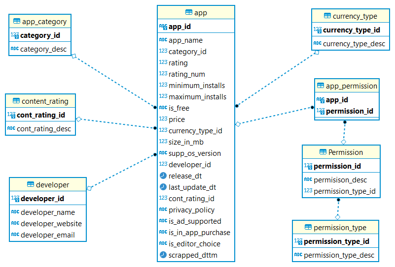

# Data Engineering Capstone

## **Project Scope:**

### **Project Summary:**

There are many apps on Google app store. The entries and records for these apps
on the app store can be analyzed to get useful insights like the following:
 - Rank of the categories for the apps.
 - Which apps get the higher rating in relation to the permisisons or features it contain.
 - Rank of the companies or developers according to the average ratings for the apps they developed.

### **Project Steps:**

This section will list the steps taken to model and implement the ETL process
for the final model.
 - ### **Gathering the datasets**:
   The datasets which are used for this project as follows:
   
    1- Google play store apps: This dataset contains the main attributes for each app on google app store. This dataset is in csv format. The link for this dataset is https://www.kaggle.com/gauthamp10/google-playstore-apps
    
    2- Android app required permissions: This dataset contains the permissions required by each app on google app store. This dataset is in json format. The link for this dataset is https://www.kaggle.com/gauthamp10/app-permissions-android?select=googleplay-app-permission.json
 - ### **Profiling the dataset:**
   Profiling has been done on the first dataset only as it contains the main attributes for this model.[Googl_App_Store.zip](Profiling_Results/Googl_App_Store.zip)
 - ### **Modelling:** 
   The model contains two layers:
   
   1- **Detail SnowFlake Schema:** This layer contains the data in a SnowFlake shmea with no aggregation. This is to support building any needed data mart
      for any future requirements. It will also serve any ad hoc queries cannot be addressed by the developed data marts in the Stark schema model.
      The list of tables included in this layer as follow:
   - App: It is main fact table and hold the information for any app on Google play store. It contains the folllowing columms:
     - App_Id: A string for app that serves as an id for the app.
     - 
   
   
       2- Start Scehma Layer: This will include any data mart to be developed to serve the defined scope for this project. It can also contains other future data marts.

        
    